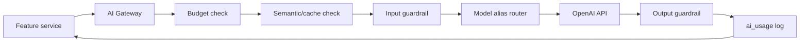

# AI Model Application Plan

## 1. Security First

The OpenAI API key must never be committed to this repository.

Use only backend/deployment secrets:

```bash
OPENAI_API_KEY=local_or_hosted_secret
```

If an API key is ever pasted into chat, screenshots, docs, commits, issues, or logs, treat it as exposed and rotate it before production or public demo use.

## 2. Source Alignment

This plan applies AI models only to features already defined in:

- `EduOne_Adaptive_Learning_Proposal_v1.0.docx`
- `EduOne_Functional_Role_Spec_v1.0.docx`
- `docs/problem/feature-blueprint.md`

AI must support the system promises:

- Content Studio drafts content, but teachers publish it.
- AI Tutor answers only from approved lesson sources.
- Path personalization remains deterministic and explainable.
- Cost and safety are first-class constraints.

## 3. Model Alias Strategy

The app should call internal aliases instead of scattered raw model names.

| Alias | Initial OpenAI model | Used for | Notes |
|---|---|---|---|
| `CONTENT_HIGH_MODEL` | `gpt-5.6-sol` | outline, lesson draft, final quality pass | Higher quality, async job, amortized per lesson |
| `CONTENT_FAST_MODEL` | `gpt-5.6-luna` | quiz, hints, highlight/tips, quest variants | Cost-sensitive generation |
| `TUTOR_MODEL` | `gpt-5.6-luna` | grounded Socratic Tutor answer | Lower runtime cost; moderated output is delivered over SSE with verified citations |
| `SUMMARY_MODEL` | `gpt-5.6-luna` | teacher/admin summaries, reports | Optional, never required for core logic |
| `EMBEDDING_MODEL` | `text-embedding-3-small` | source chunks and Tutor query vectors | Matches current `vector(1536)` schema |
| `MODERATION_MODEL` | `omni-moderation-latest` | input/output safety checks | Text now, image/text later for community |
| `REALTIME_MODEL` | `gpt-realtime-2.1` | future voice Tutor / live voice agent | Phase 2/3, not MVP default |

Important: `CONTENT_HIGH_MODEL`, `CONTENT_FAST_MODEL`, `TUTOR_MODEL`, and `SUMMARY_MODEL` can initially point to the same model while the AI Gateway still records feature, tier, latency, cost, and quality. Later we tune aliases without changing feature code.

## 4. AI Gateway Routing



Gateway responsibilities:

- read model alias config;
- check `daily_cost_budgets.circuit_tripped`;
- apply cache where allowed;
- run moderation/guardrails;
- call OpenAI;
- normalize output;
- write `ai_usage`;
- return structured errors.

## 5. Feature-by-feature Model Plan

### M1 — Tài khoản & phân quyền

Source: `FR0`, `F-101 -> F-107`, `P-01`.

| Feature | AI? | Model | Reason |
|---|---:|---|---|
| Login, session, RBAC | No | none | Security logic must be deterministic |
| Guardian consent copy | Optional | `SUMMARY_MODEL` only for drafting UI copy | Not needed in MVP runtime |
| Role assignment | No | none | Admin action + audit |

Rule: AI never decides roles, permissions, or consent validity.

### M2 + M3 — STEAM profile and tests

Source: `FR1`, `FR2`, `F-201 -> F-308`, `P-02`, `P-09`.

| Feature | AI? | Model | Reason |
|---|---:|---|---|
| Score calculation | No | none | Must be transparent and reproducible |
| Radar explanation | Yes-lite | `SUMMARY_MODEL` | Convert numeric profile into age-appropriate explanation |
| Question generation for teacher review | Yes | `CONTENT_FAST_MODEL` | Generate draft test/quiz questions, always `DRAFT` |
| Question coverage audit | No | none | Count minimum 5 questions per STEAM axis |

Output requirement for AI-generated questions:

- JSON schema with `body`, `options`, `answer_key`, `steam_weights`, `difficulty`, `source_reason`;
- saved as `DRAFT`;
- teacher/admin review before use.

### M4 — Learning Path

Source: `FR3`, `FR4`, `F-401 -> F-408`, `P-03`, `P-08`.

| Feature | AI? | Model | Reason |
|---|---:|---|---|
| Next Skill Node | No | none | Path Engine must be rule-based |
| Lock/unlock logic | No | none | Deterministic thresholds |
| Reason text formatting | Optional | `SUMMARY_MODEL` | Only to phrase explanation; numbers come from rules |
| Recovery/pre-course suggestion | No | none | Based on missing STEAM axis |

Rule: AI can phrase a reason, but cannot invent the reason.

### M5 — Lesson Player

Source: `FR4.5`, `FR5.2`, `FR5.3`, `F-501 -> F-506`, `P-04`.

| Feature | AI? | Model | Reason |
|---|---:|---|---|
| Render checkpoint lesson | No | none | Reads `PUBLISHED` lesson JSON |
| Quiz feedback | Optional | `TUTOR_MODEL` or templated feedback | Prefer deterministic feedback first |
| Hint expansion | Yes | `CONTENT_FAST_MODEL` at creation time | Hints should be generated in Content Studio and reviewed |
| Task rubric explanation | Optional | `SUMMARY_MODEL` | Teacher-facing or student-friendly copy |

Rule: runtime lesson player should mostly consume published content; avoid per-click AI cost.

### M6 — AI Tutor

Source: `FR9`, `F-601 -> F-609`, `P-05`, `NFR-6`.

| Feature | AI? | Model | Reason |
|---|---:|---|---|
| Embed student question | Yes | `EMBEDDING_MODEL` | Query vector for retrieval |
| Retrieve sources | No generation | pgvector + SQL | Must filter current Skill Node and `PUBLISHED` source |
| Input safety | Yes | `MODERATION_MODEL` | Before Tutor model |
| Socratic answer | Yes | `TUTOR_MODEL` | Streamed answer with citations |
| Output safety | Yes | `MODERATION_MODEL` | Before display if risk detected |
| Out-of-scope refusal | Prefer no LLM | template or `TUTOR_MODEL` with strict refusal | Do not hallucinate |
| Escalation summary | Optional | `SUMMARY_MODEL` | Teacher queue summary, no private overexposure |

Tutor prompt must require:

- use only provided chunks;
- cite checkpoint/source chunk IDs;
- refuse if source is insufficient;
- ask guiding questions for graded tasks;
- Vietnamese, age-appropriate language.

### M7 — Content Studio

Source: `FR5`, `F-701 -> F-712`, `P-06`, `P-07`, `NFR-10`, `NFR-14`.

| Stage | Model | Output | Safety gate |
|---|---|---|---|
| Extract text | none / OCR later | raw text | teacher source only |
| Chunk + embed | `EMBEDDING_MODEL` | `document_chunks` | not student-visible |
| Outline generation | `CONTENT_HIGH_MODEL` | checkpoints | saved `DRAFT` |
| Checkpoint draft | `CONTENT_HIGH_MODEL` | lesson JSON | saved `DRAFT` |
| Quiz + hints | `CONTENT_FAST_MODEL` | question JSON | saved `DRAFT` |
| Quest idea | `CONTENT_FAST_MODEL` | story/task idea | teacher review |
| Quality check | `CONTENT_HIGH_MODEL` or deterministic checks | issues list | teacher decides |
| Publish | none | status change + audit | human action only |

Rule: Content Studio can use a stronger model because generation happens once per lesson and is reused by many students.

### M8 — Gamification

Source: `FR6`, `F-801 -> F-808`, `P-04`.

| Feature | AI? | Model | Reason |
|---|---:|---|---|
| EXP calculation | No | none | Must be auditable |
| Level calculation | No | none | Config table |
| Badge award | No | none | Rule-based |
| Badge microcopy | Optional | `SUMMARY_MODEL` | Static content generation only |

Rule: no public leaderboard and no AI ranking students.

### M9 — Teacher Tracking & Risk

Source: `FR10`, `F-901 -> F-904`, `P-10`.

| Feature | AI? | Model | Reason |
|---|---:|---|---|
| Risk score | No | none | Proposal requires transparent rules |
| Heatmap | No | none | Aggregation |
| Intervention suggestion | Optional | `SUMMARY_MODEL` | Phrase teacher action suggestions from rule reasons |
| Class summary | Optional | `SUMMARY_MODEL` | Weekly teacher summary, no raw private chat |

Rule: AI may summarize patterns, not label students in hidden black-box ways.

### M10 — Community STEAM

Source: `FR8`, `F-1001 -> F-1006`, `P-12`. Phase 2.

| Feature | AI? | Model | Reason |
|---|---:|---|---|
| Text/image moderation | Yes | `MODERATION_MODEL` | Before display |
| Manual review queue summary | Optional | `SUMMARY_MODEL` | Help moderator triage |
| Community vote | No | none | Product rule, not AI |

Rule: community is Phase 2 because UGC from children raises safety and operations risk.

### M11 — Admin & Operations

Source: `FR10.4`, `NFR-3`, `NFR-7`, `NFR-14`, `F-1101 -> F-1107`, `P-13`.

| Feature | AI? | Model | Reason |
|---|---:|---|---|
| Cost dashboard | No | none | SQL aggregation |
| Circuit breaker | No | none | Deterministic budget rule |
| Audit log | No | none | Append-only records |
| AI usage explanation | Optional | `SUMMARY_MODEL` | Human-readable admin explanation |
| Model router | Config only | aliases above | No feature code model literals |

Rule: all model calls must write `ai_usage`.

## 6. MVP Model Routing

For hackathon MVP, use the smallest model set that proves the AI architecture:

| MVP slice | Required model aliases |
|---|---|
| Student Dashboard + Path | none, optional `SUMMARY_MODEL` for explanation copy |
| Lesson Player | none, consumes published content |
| AI Tutor + Escalation | `EMBEDDING_MODEL`, `MODERATION_MODEL`, `TUTOR_MODEL` |
| Content Studio | `EMBEDDING_MODEL`, `CONTENT_HIGH_MODEL`, `CONTENT_FAST_MODEL`, `MODERATION_MODEL` |
| Teacher/Admin proof panels | none, optional `SUMMARY_MODEL` |

This keeps the demo cheap and clear: AI is used where language generation/retrieval matters, not where rules should decide.

## 7. Environment Configuration

Backend runtime:

```bash
OPENAI_API_KEY=replace_with_secret
OPENAI_CONTENT_HIGH_MODEL=gpt-5.6-sol
OPENAI_CONTENT_FAST_MODEL=gpt-5.6-luna
OPENAI_TUTOR_MODEL=gpt-5.6-luna
OPENAI_SUMMARY_MODEL=gpt-5.6-luna
OPENAI_EMBEDDING_MODEL=text-embedding-3-small
OPENAI_MODERATION_MODEL=omni-moderation-latest
OPENAI_REALTIME_MODEL=gpt-realtime-2.1
AI_DAILY_BUDGET_USD=5
AI_TUTOR_DAILY_LIMIT_PER_STUDENT=20
AI_ALLOW_APPROVED_CONTENT_EXPORT=false
```

Never expose these through frontend environment variables except non-secret feature flags.

The current OpenAI project exposes the concrete `sol`/`terra`/`luna` model IDs but rejects the generic `gpt-5.6` alias. The implementation therefore uses concrete IDs behind environment aliases. Model capability must be rechecked for each deployment project.

## 8. Cost Controls

Controls required by `NFR-3`:

- Semantic cache for repeated Tutor questions in the same Skill Node.
- AI Gateway tier routing.
- Daily budget circuit breaker.
- Per-student Tutor question limit.
- Batch/asynchronous Content Studio jobs.
- Prompt caching when available.
- Store generated lesson content once and reuse it.

## 9. Quality & Safety Evaluation

Before demo:

- 10 in-scope Tutor questions must answer with citations.
- 5 out-of-scope questions must refuse.
- 5 prompt-injection source chunks must fail safely.
- 5 "give me the answer" quiz prompts must trigger Socratic hints.
- Content Studio draft must be editable and publishable only by teacher.
- `ai_usage` must show feature/model/tokens/cost/cache_hit.

## 10. Official References

- OpenAI text generation and Responses API guide: https://developers.openai.com/api/docs/guides/text
- OpenAI model selection guide: https://developers.openai.com/api/docs/guides/model-selection
- OpenAI embeddings guide: https://developers.openai.com/api/docs/guides/embeddings
- OpenAI moderation guide: https://developers.openai.com/api/docs/guides/moderation
- OpenAI Realtime/audio guide: https://developers.openai.com/api/docs/guides/realtime
- OpenAI guardrails and human review guide: https://developers.openai.com/api/docs/guides/agents/guardrails-approvals

## 11. Addendum — Tutor interactive exercises (Slice 5)

Extends M6. The Tutor generates interactive practice (mcq | matching | ordering | cloze) with `CONTENT_FAST_MODEL` in structured JSON mode, grounded on the current Skill Node's approved chunks, moderated, and logged to `ai_usage` as feature `tutor_exercise` (tier 2). Generation is one small call per exercise and reuses the same fail-closed export gate and daily budget/limit as the Tutor answer. Grading and effort-EXP are deterministic (no model). This is where AI intervenes beyond chat — but stays formative and never edits the STEAM profile.
