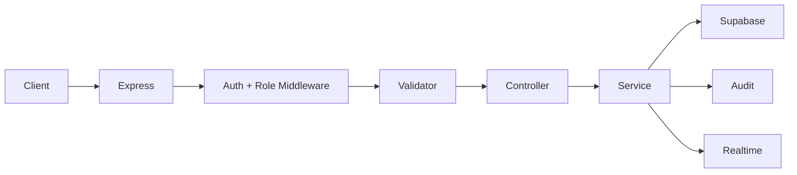

# Backend & Realtime Architecture — Node.js + Express

## 1. Purpose

The backend owns application rules that should not live in the browser: RBAC checks, path generation, AI gateway calls, RAG retrieval, cost tracking, audit writes, and realtime notifications.

## 2. Backend Structure

```text
backend/
  api/
    routes/
    controllers/
    validators/
  services/
    auth/
    path-engine/
    learning/
    content-studio/
    tutor/
    ai-gateway/
    analytics/
    audit/
    realtime/
  models/
    dto/
    domain/
  middleware/
    requireAuth.js
    requireRole.js
    errorHandler.js
    requestLogger.js
  utils/
    logger.js
    env.js
  tests/
```

## 3. Request Flow



## 4. Realtime Strategy

| Need | Technology | Reason |
|---|---|---|
| Tutor token streaming | SSE | Simple one-way stream, matches NFR token-first UX |
| Job/escalation notifications | Socket.IO | Bidirectional, room-based by role/class/user |
| Supabase DB change fan-out | Backend listener later | Keeps RLS and payload shaping centralized |

Socket rooms:

- `user:{userId}` for personal notifications.
- `teacher:{teacherId}` for escalations and job status.
- `class:{classId}` for class dashboard updates.
- `admin:{orgId}` for cost and audit events.

## 5. Services

| Service | Responsibility |
|---|---|
| `auth` | Verify Supabase JWT, load profile, enforce role |
| `classroom` | Subject catalog, teacher-owned classes, membership state transitions |
| `path-engine` | Rule-based Skill Node unlock and next recommendation |
| `learning` | Attempts, progress, score events, EXP events |
| `content-studio` | Source upload, job lifecycle, draft, review, publish |
| `tutor` | Session, retrieval, streaming answer, refusal, escalation |
| `ai-gateway` | Provider routing, cache, cost, circuit breaker |
| `analytics` | Heatmap, risk score, production report |
| `audit` | Append-only action records |
| `realtime` | Socket.IO room events and SSE helpers |

## 6. Error Handling

All API errors return:

```json
{
  "error": {
    "code": "LESSON_NOT_PUBLISHED",
    "message": "This lesson is not available yet.",
    "requestId": "req_..."
  }
}
```

Do not leak provider errors, prompts, service keys, or stack traces to the client.

## 7. Logging

Log these events:

- auth failures;
- AI requests and provider failures;
- RAG retrieval source counts;
- content job transitions;
- publish actions;
- cost circuit breaker changes;
- tutor escalations;
- unexpected errors.

## 8. Backend Must Enforce

- Student APIs never return DRAFT/IN_REVIEW lessons.
- Teacher publish writes `reviewed_by`, `published_at`, and `audit_log`.
- Tutor retrieval is scoped to current Skill Node and approved source material.
- Cost limits are checked before AI calls.
- Parent APIs never return raw tutor messages.

## 9. Slice 1 Implementation Status

Implemented:

- Express app, request IDs, stable error envelope, health endpoint, and CORS allowlist.
- Supabase server client isolated under `backend/services`.
- Student dashboard aggregation service.
- Pure rule-based path engine with unit tests.
- Socket.IO server and client connection-ready event.
- Idempotent demo seed for the existing Supabase schema.
- Published-only lesson service and server-side quiz grading.
- First-correct score/EXP event writes, projection update, and streak refresh.
- AI Gateway with model aliases, moderation, usage/cost accounting, daily limits, and budget circuit.
- Tutor session persistence, approved-source hybrid retrieval, Responses API generation, safe SSE delivery, and escalation queue.
- Teacher-scoped `tutor.escalated` Socket.IO event without raw conversation content.
- Supabase access-token verification for REST and Socket.IO.
- Server-side profile, role, and active-account middleware on every protected route.
- Role-aware profile bootstrap: public student or teacher; student-only learning projections.
- Subject validation and same-organization/same-grade classroom membership enforcement.
- Teacher-owned class CRUD slice, join codes, invitations, requests, decisions, and roster reads.
- `class.membership.updated` fan-out to the affected teacher and student rooms.
- Guardian-pending and inactive account gates shared by REST and realtime.
- Removal of all first-student and client-supplied identity fallbacks.

Pending before pilot scale:

- production structured logger and rate limiting;
- transactional Postgres RPC for attempt + score + EXP writes before pilot scale;
- transactional Postgres RPC for AI usage + daily budget projection updates;
- guardian consent delivery/verification and parent-link workflow;
- teacher organization/domain verification, registration audit, and invitation rate limiting before pilot;
- administrator service for admin account provisioning.
