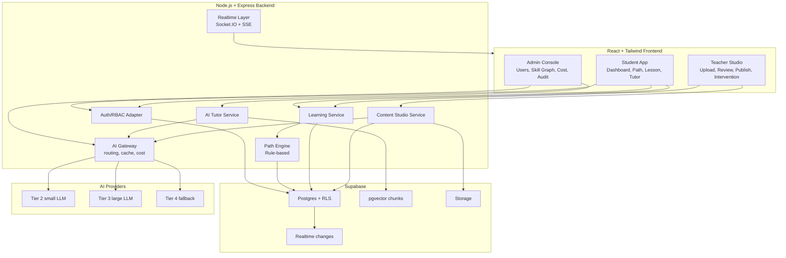
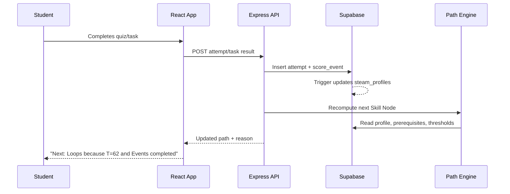
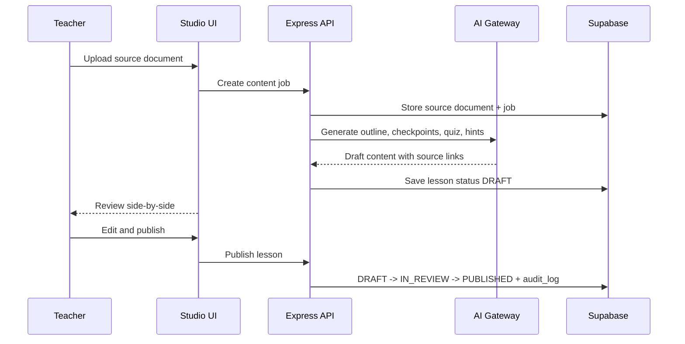
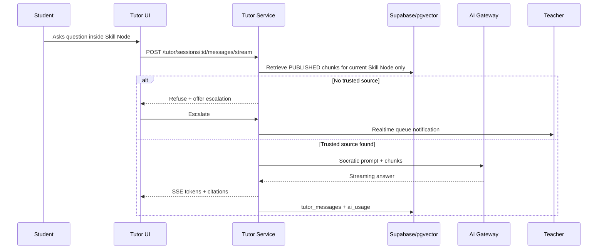

# System Design — EduOne Adaptive Learning & Content Studio

## 1. Design Intent

EduOne is not a chatbot added to an LMS. The product is an adaptive learning loop:

- The student learns in short, quest-like checkpoints.
- Every activity emits learning signals.
- The path engine turns those signals into explainable next steps.
- Content Studio helps teachers generate and approve content faster.
- AI Tutor supports students only inside approved learning material.

The architecture must make three promises enforceable:

1. AI-generated lesson content never reaches students before human review.
2. AI Tutor never answers from unapproved or out-of-scope sources.
3. Learning path decisions are deterministic, low-cost, and explainable.

## 2. Logical Architecture

## 3. Bounded Contexts

| Context | Responsibility | Must Not Do |
|---|---|---|
| Identity & RBAC | Supabase Auth profile, roles, guardian consent | Trust client-side role checks |
| Skill Graph | Skill Nodes, prerequisites, unlock thresholds | Use LLM for unlock decisions |
| Learning Profile | `score_events` and `steam_profiles` projection | Let teachers manually edit scores |
| Learning Experience | Published lessons, quiz, hints, tasks, progress | Read DRAFT lessons for students |
| Content Studio | Upload, chunk, generate draft, review, publish | Auto-publish AI output |
| AI Tutor | Grounded answers, citations, escalation | Use global knowledge or DRAFT chunks |
| Gamification | EXP, level, streak, badges | Unlock academic content |
| Analytics & Risk | Heatmap, dropout risk, cost dashboard | Show `AT_RISK` labels to students |
| Audit & Safety | Append-only audit, moderation, cost circuit breaker | Allow update/delete on audit records |

## 4. Core Workflows

### Student Learning Loop

### Teacher Content Studio Loop

### Grounded AI Tutor Loop

## 5. Non-Negotiable Invariants

- Student-facing APIs must only select `lessons.status = 'PUBLISHED'`.
- RAG retrieval must join through a published lesson or an approved Q&A source.
- `score_events` and `exp_events` are append-only sources of truth.
- `steam_profiles` and `exp_totals` are projections, not manual-edit tables.
- Parent dashboards never expose identifiable Tutor chat content.
- AI usage is recorded for every AI call, including cache hits and failures.
- Cost circuit breaker must degrade AI features without breaking the learning app.

## 6. MVP Demo Spine

One strong demo workflow is better than many thin screens:

1. Student sees joyful dashboard with STEAM radar and explainable next lesson.
2. Student opens a published Scratch Skill Node and asks AI Tutor.
3. Tutor answers with citation or refuses out-of-scope and escalates.
4. Teacher sees the escalation and Content Studio review queue.
5. Teacher publishes a generated lesson and the student path updates.
6. Admin sees AI cost and safety/audit evidence.

## 7. Key Design Debt To Resolve Early

- Add a database-safe retrieval path so `document_chunks` cannot leak DRAFT source material.
- Add a scheduled budget function to set `daily_cost_budgets.circuit_tripped`.
- Define exact teacher-to-class ownership tables before R2 scoped reads are implemented.
- Decide Basic/Advanced threshold after pilot data, but keep it configurable from day one.

