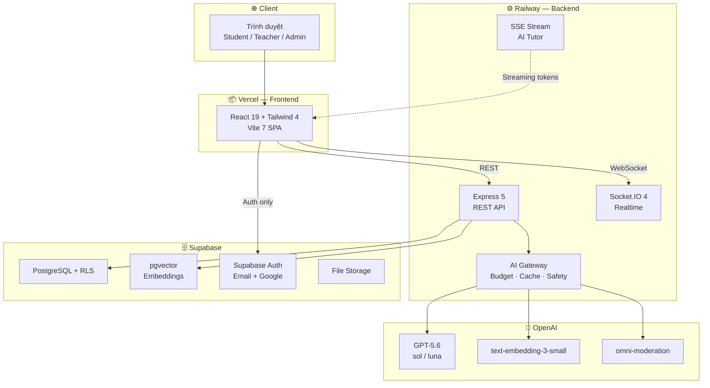
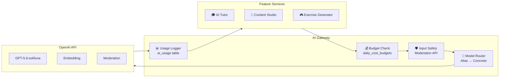
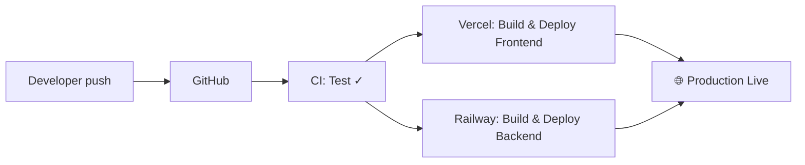
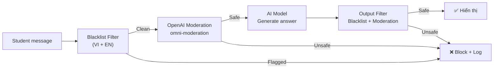

# 🚀 EduOne — Hướng Dẫn Deploy Hoàn Chỉnh

> **Dự án:** EduOne Adaptive Learning & Content Studio  
> **Stack:** React + Express + Supabase + OpenAI  
> **Cập nhật:** 18/07/2026

---

## Mục Lục

| # | Nội dung | Mục đích |
|---|---|---|
| 1 | [Tổng Quan Kiến Trúc](#1-tổng-quan-kiến-trúc) | Hiểu hệ thống trước khi deploy |
| 2 | [Yêu Cầu Tiên Quyết](#2-yêu-cầu-tiên-quyết) | Chuẩn bị tools & accounts |
| 3 | [Deploy Nhanh — Local Dev (5 phút)](#3-deploy-nhanh--local-dev-5-phút) | Chạy ngay trên máy |
| 4 | [Cấu Hình AI Pipeline](#4-cấu-hình-ai-pipeline) | OpenAI, Gateway, Safety |
| 5 | [Database — Supabase](#5-database--supabase) | Schema, migrations, seeds |
| 6 | [Deploy Cloud — Production](#6-deploy-cloud--production) | Vercel + Railway + Supabase |
| 7 | [Deploy Bằng Docker](#7-deploy-bằng-docker) | Container hoá toàn bộ |
| 8 | [CI/CD Pipeline](#8-cicd-pipeline) | Tự động hoá deploy |
| 9 | [AI Safety & Cost Control](#9-ai-safety--cost-control) | An toàn K-12, budget |
| 10 | [Monitoring & Health Check](#10-monitoring--health-check) | Giám sát hệ thống |
| 11 | [Security Checklist](#11-security-checklist) | Bảo mật |
| 12 | [Demo Preparation](#12-demo-preparation) | Sẵn sàng demo VAIC |
| 13 | [Troubleshooting](#13-troubleshooting) | Xử lý lỗi thường gặp |
| 14 | [Phụ Lục](#14-phụ-lục) | API Reference, cấu trúc repo |

---

## 1. Tổng Quan Kiến Trúc

### 1.1. Sơ đồ hệ thống



### 1.2. Bảng thành phần

| Thành phần | Stack | Hosting | Free Tier? |
|---|---|---|---|
| Frontend | React 19, Tailwind CSS 4, Vite 7, Recharts, Lucide | **Vercel** | ✅ |
| Backend API | Node.js 20, Express 5, Socket.IO 4 | **Railway** hoặc **Render** | ✅ |
| Database | PostgreSQL + pgvector + RLS | **Supabase** | ✅ (500MB) |
| Auth | Email/Password + Google OAuth | **Supabase Auth** | ✅ |
| AI Models | GPT-5.6-sol, GPT-5.6-luna, text-embedding-3-small | **OpenAI API** | ❌ (pay-per-use) |
| Realtime | Socket.IO (bidirectional) + SSE (Tutor streaming) | Cùng backend | — |

---

## 2. Yêu Cầu Tiên Quyết

### 2.1. Phần mềm cần cài

```bash
# Kiểm tra versions
node --version     # >= 20.x  (LTS)
npm --version      # >= 10.x
git --version      # >= 2.40
```

| Tool | Link tải | Lưu ý |
|---|---|---|
| **Node.js 20 LTS** | https://nodejs.org | Chọn LTS, không dùng Current |
| **Git** | https://git-scm.com | Windows: chọn "Git Bash" |
| **Docker** *(optional)* | https://docker.com | Chỉ cần nếu deploy Docker |

### 2.2. Tài khoản cloud (cho Production)

| Service | URL | Cần cho |
|---|---|---|
| **Supabase** | https://supabase.com | Database + Auth |
| **Vercel** | https://vercel.com | Frontend hosting |
| **Railway** | https://railway.app | Backend hosting |
| **OpenAI** | https://platform.openai.com | AI features |

> [!TIP]
> **Cho hackathon/demo:** Chỉ cần Supabase + OpenAI API key, chạy local là đủ. Cloud deploy là bonus.

---

## 3. Deploy Nhanh — Local Dev (5 phút)

### ⚡ Quick Start — Copy-paste chạy ngay

```bash
# ── Bước 1: Clone ──────────────────────────────────
git clone <repository-url>
cd AI_innovation_challenge

# ── Bước 2: Backend ────────────────────────────────
cd backend
cp .env.example .env
# 👉 Mở .env → điền SUPABASE_SERVICE_ROLE_KEY và OPENAI_API_KEY
npm install
npm run seed:demo        # Seed 7 Skill Nodes + demo users
npm run seed:subjects    # Seed 28 môn học GDPT 2018
npm run seed:sources     # Seed approved Tutor grounding chunks

# ── Bước 3: Chạy backend ───────────────────────────
npm start                # → http://localhost:4000

# ── Bước 4: Frontend (terminal mới) ────────────────
cd ../frontend
cp .env.example .env
npm install
npm run dev              # → http://127.0.0.1:5173
```

### 3.1. Chi tiết cấu hình `.env`

**`backend/.env`** — Tối thiểu cần 2 biến bắt buộc:

```bash
# ⚠️ BẮT BUỘC
SUPABASE_URL=https://your-project-id.supabase.co
SUPABASE_SERVICE_ROLE_KEY=sb_secret_xxxxxxxxxxxx

# Tuỳ chọn — AI features (không có thì fallback rule-based)
OPENAI_API_KEY=sk-proj-xxxxxxxxxxxxxxxx

# Mặc định — không cần thay đổi nếu dùng demo
PORT=4000
OPENAI_CONTENT_HIGH_MODEL=gpt-5.6-sol
OPENAI_CONTENT_FAST_MODEL=gpt-5.6-luna
OPENAI_TUTOR_MODEL=gpt-5.6-luna
OPENAI_SUMMARY_MODEL=gpt-5.6-luna
OPENAI_EMBEDDING_MODEL=text-embedding-3-small
OPENAI_MODERATION_MODEL=omni-moderation-latest
AI_DAILY_BUDGET_USD=5
AI_TUTOR_DAILY_LIMIT_PER_STUDENT=20
AI_ALLOW_APPROVED_CONTENT_EXPORT=false
```

**`frontend/.env`** — Không có secret, an toàn để commit:

```bash
VITE_API_BASE_URL=http://localhost:4000/api
VITE_REALTIME_URL=http://localhost:4000
VITE_SUPABASE_URL=https://your-project-id.supabase.co
VITE_SUPABASE_PUBLISHABLE_KEY=sb_publishable_xxxxxxxxxxxx
```

### 3.2. Xác nhận deploy thành công

```bash
# Health check backend
curl http://localhost:4000/api/health
# ✅ {"data":{"status":"ok","service":"eduone-api","realtime":true}}

# Frontend
# ✅ Mở http://127.0.0.1:5173/login trên trình duyệt
```

### 3.3. Tạo tài khoản demo

| Vai trò | Cách tạo | Lưu ý |
|---|---|---|
| **Student** | `/register` → chọn "Học sinh" | Dưới 16 tuổi → `PENDING` (cần guardian) |
| **Teacher** | `/register` → chọn "Giáo viên" | Kích hoạt ngay, không cần approval |

### 3.4. Reset state cho demo lại

```bash
cd backend
npm run reset:demo    # Reset progress demo student → trạng thái ban đầu
```

---

## 4. Cấu Hình AI Pipeline

EduOne sử dụng **3 AI module chính**, tất cả đi qua một **AI Gateway** tập trung.

### 4.1. Kiến trúc AI Gateway



### 4.2. Model Aliases — Dễ thay đổi model mà không sửa code

| Alias (biến môi trường) | Model mặc định | Dùng cho | Chi phí |
|---|---|---|---|
| `OPENAI_CONTENT_HIGH_MODEL` | `gpt-5.6-sol` | Content Studio: lesson draft chất lượng cao | $5/$30 per 1M tokens |
| `OPENAI_CONTENT_FAST_MODEL` | `gpt-5.6-luna` | Quiz, hints, exercise generation | $1/$6 per 1M tokens |
| `OPENAI_TUTOR_MODEL` | `gpt-5.6-luna` | AI Tutor: Socratic answers + citations | $1/$6 per 1M tokens |
| `OPENAI_SUMMARY_MODEL` | `gpt-5.6-luna` | Summaries, reports (optional) | $1/$6 per 1M tokens |
| `OPENAI_EMBEDDING_MODEL` | `text-embedding-3-small` | RAG: document chunk embeddings | $0.02 per 1M tokens |
| `OPENAI_MODERATION_MODEL` | `omni-moderation-latest` | Input/output safety (K-12) | Free |

> [!IMPORTANT]
> **Tất cả model aliases có thể trỏ cùng 1 model** trong hackathon. AI Gateway vẫn log riêng feature, tier, latency, cost. Khi cần tối ưu chỉ cần đổi biến env, không sửa code.

### 4.3. Transfer Gate — `AI_ALLOW_APPROVED_CONTENT_EXPORT`

Đây là **kill switch** quan trọng nhất cho AI safety:

| Giá trị | Hành vi |
|---|---|
| `false` (mặc định) | ❌ Không gửi bất kỳ nội dung nào đến OpenAI. Tutor/Content Studio dùng local fallback. Embeddings không tạo. |
| `true` | ✅ Cho phép gửi approved content đến OpenAI. Tutor hoạt động AI, Content Studio tạo AI draft. |

```bash
# Chỉ bật khi đã có approval chuyển dữ liệu giáo dục ra ngoài
AI_ALLOW_APPROVED_CONTENT_EXPORT=true
```

### 4.4. AI Tiering — Khi nào dùng AI, khi nào không

```
┌─────────────────────────────────────────────────────────────┐
│ Tier 1: Cache + Rules (KHÔNG gọi AI)                       │
│  • Path Engine (rule-based, deterministic)                  │
│  • Score/EXP/Streak calculation                             │
│  • Badge award                                              │
│  • Lesson rendering (published content)                     │
│  • Quiz grading (server-side, exact match)                  │
├─────────────────────────────────────────────────────────────┤
│ Tier 2: Small LLM (gpt-5.6-luna — rẻ, nhanh)              │
│  • AI Tutor: Socratic answers                               │
│  • Tutor exercises: mcq, matching, ordering, cloze          │
│  • Content Studio: quiz, hints, fast draft                  │
│  • Embeddings: text-embedding-3-small                       │
│  • Moderation: omni-moderation-latest (FREE)                │
├─────────────────────────────────────────────────────────────┤
│ Tier 3: Larger LLM (gpt-5.6-sol — cao cấp)                │
│  • Content Studio: full lesson outline + checkpoint draft   │
│  • Quality check pass                                       │
├─────────────────────────────────────────────────────────────┤
│ Tier 4: Fallback (khi AI lỗi/hết budget)                   │
│  • Content Studio: local structured draft generator         │
│  • AI Tutor: "Hệ thống AI đang bận" + link tài liệu       │
│  • Path Engine: luôn hoạt động (không phụ thuộc AI)         │
└─────────────────────────────────────────────────────────────┘
```

### 4.5. Chạy AI lần đầu — Seed Tutor Knowledge

```bash
cd backend

# Bước 1 (bắt buộc): Tạo approved grounding chunks từ lesson content
npm run seed:sources

# Bước 2 (optional): Tạo embeddings — CẦN OPENAI_API_KEY + approval
# ⚠️ Lệnh này gửi checkpoint excerpts đến OpenAI
npm run seed:tutor
```

> [!NOTE]
> `seed:sources` tạo `document_chunks` từ published lessons. `seed:tutor` gọi OpenAI để tạo vector embeddings. Không có embeddings thì Tutor vẫn hoạt động bằng lexical grounding — chỉ thiếu semantic search.

### 4.6. Khi không có OpenAI API Key

Hệ thống **không crash**, mọi AI feature degrade gracefully:

| Module | Hành vi khi không có API key |
|---|---|
| **Path Engine** | ✅ Hoạt động bình thường (rule-based, không dùng AI) |
| **Lesson Player** | ✅ Hoạt động bình thường (render published content) |
| **Quiz/Scoring** | ✅ Hoạt động bình thường (server grading) |
| **AI Tutor** | ⚠️ Trả lỗi "AI Tutor chưa được cấu hình" → student có thể escalate |
| **Content Studio** | ⚠️ Fallback local draft generator (structured, no AI) |
| **Exercises** | ⚠️ Không tạo mới, bài cũ vẫn hoạt động |

---

## 5. Database — Supabase

### 5.1. Tạo Supabase Project mới

1. Vào [supabase.com](https://supabase.com) → **New Project**
2. Chọn **Region**: `Southeast Asia (Singapore)` — gần Việt Nam nhất
3. Đặt **Database Password** mạnh
4. Lưu lại 3 thông tin:

```
Project URL:        https://xxxx.supabase.co
Publishable Key:    sb_publishable_xxxx        ← Frontend dùng
Service Role Key:   sb_secret_xxxx             ← Backend dùng (KHÔNG expose)
```

### 5.2. Bật Extensions

Chạy trên **Supabase Dashboard → SQL Editor**:

```sql
CREATE EXTENSION IF NOT EXISTS vector;      -- pgvector cho RAG
CREATE EXTENSION IF NOT EXISTS pgcrypto;    -- UUID generation
```

### 5.3. Áp dụng Migrations (thứ tự quan trọng)

Chạy SQL tuần tự trên Supabase SQL Editor:

| Thứ tự | File | Nội dung |
|---|---|---|
| 1 | `database/migrations/0002_tutor_interactive_exercises.sql` | Bảng `tutor_exercises` + `tutor_exercise_attempts` |
| 2 | `database/migrations/0003_classes_and_subjects.sql` | Bảng `subjects`, `classes`, `class_memberships` |

> [!CAUTION]
> Phải áp dụng migrations **trước khi** chạy `seed:subjects`. Schema base đã tồn tại trên Supabase — 2 file trên chỉ là incremental migrations.

### 5.4. Seed Data Pipeline

```bash
cd backend

# 1️⃣ Demo data: org, users, 7 skill nodes, lessons, STEAM profiles
npm run seed:demo

# 2️⃣ Subjects: 28 GDPT 2018 STEAM subjects  
npm run seed:subjects

# 3️⃣ Tutor sources: approved grounding chunks cho mọi published lesson
npm run seed:sources

# 4️⃣ (Optional) Embeddings: vector embeddings cho semantic search
# ⚠️ Cần OPENAI_API_KEY + AI_ALLOW_APPROVED_CONTENT_EXPORT=true
npm run seed:tutor
```

### 5.5. Bảng dữ liệu chính

```
📊 Core Tables
├── organizations              Tổ chức / trường
├── profiles                   User profiles (student/teacher/admin)
├── skill_nodes                STEAM Skill Graph nodes
├── skill_prerequisites        Node dependencies
├── lessons                    Bài học (DRAFT → IN_REVIEW → PUBLISHED)
├── questions                  MCQ (answer_key server-only)
├── checkpoints                Lesson checkpoints
│
📈 Learning Data
├── score_events               Append-only STEAM score changes
├── steam_profiles             STEAM vector projections
├── exp_totals                 XP projections
├── streaks                    Learning streaks
├── badges                     Achievements
├── quiz_attempts              Quiz records
│
🤖 AI & Tutor
├── source_documents           Teacher-uploaded sources
├── document_chunks            RAG chunks + pgvector embeddings
├── content_jobs               Content generation jobs
├── tutor_sessions             Chat sessions
├── tutor_messages             Chat messages
├── tutor_escalations          Teacher escalation queue
├── tutor_exercises            Interactive exercises
├── tutor_exercise_attempts    Exercise attempts
│
🛡️ Safety & Audit
├── ai_usage                   AI call logging (cost, latency, cache)
├── daily_cost_budgets         Per-org daily AI budget
├── audit_log                  Append-only audit trail
│
🏫 Classes
├── subjects                   GDPT 2018 STEAM subject catalog
├── classes                    Teacher-owned classes
└── class_memberships          Student-class membership lifecycle
```

### 5.6. Supabase Auth Configuration

Trên **Supabase Dashboard → Authentication → Providers**:

- [x] **Email/Password**: Bật (mặc định)
- [ ] **Google OAuth** (optional):
  - Google Cloud Console → Tạo OAuth Client ID
  - Redirect URL: `https://xxx.supabase.co/auth/v1/callback`
  - Điền Client ID + Secret vào Supabase Dashboard

---

## 6. Deploy Cloud — Production

### 🏗️ Phương hướng deploy nhanh cho dự án có AI

```
┌─────────────────────────────────────────────────────────────────┐
│                    CHIẾN LƯỢC DEPLOY                            │
│                                                                 │
│  Frontend (Static)  ──→  Vercel     (free, auto-deploy, CDN)   │
│  Backend  (Node.js) ──→  Railway    (free tier, WebSocket OK)   │
│  Database           ──→  Supabase   (managed, free 500MB)      │
│  AI Provider        ──→  OpenAI API (pay-per-use, $5/day cap)  │
│                                                                 │
│  💡 Tổng chi phí: $0/tháng (trừ OpenAI usage ~$1-5/ngày demo) │
└─────────────────────────────────────────────────────────────────┘
```

> [!TIP]
> **Tại sao chọn combo này?**
> - **Vercel**: Deploy React SPA trong 2 phút, CDN toàn cầu, preview per-PR
> - **Railway**: Support WebSocket (Socket.IO) + SSE (AI streaming) out-of-box
> - **Supabase**: PostgreSQL managed + Auth + Storage + pgvector, zero ops
> - **OpenAI**: Duy nhất cần trả tiền, nhưng có budget circuit breaker tự động

---

### 6.1. Frontend → Vercel

**Thời gian: ~3 phút**

#### Bước 1: Connect Repository

```
Vercel.com → New Project → Import Git Repository → Chọn repo
```

#### Bước 2: Build Settings

| Field | Value |
|---|---|
| Framework Preset | `Vite` |
| Root Directory | `frontend` |
| Build Command | `npm run build` |
| Output Directory | `dist` |
| Node.js Version | `20.x` |

#### Bước 3: Environment Variables

Thêm trên Vercel → **Settings → Environment Variables**:

| Variable | Value |
|---|---|
| `VITE_API_BASE_URL` | `https://your-backend.up.railway.app/api` |
| `VITE_REALTIME_URL` | `https://your-backend.up.railway.app` |
| `VITE_SUPABASE_URL` | `https://xxx.supabase.co` |
| `VITE_SUPABASE_PUBLISHABLE_KEY` | `sb_publishable_xxx` |

#### Bước 4: SPA Routing Fix

Tạo `frontend/vercel.json`:

```json
{
  "rewrites": [
    { "source": "/(.*)", "destination": "/index.html" }
  ]
}
```

#### Bước 5: Deploy

```bash
git add frontend/vercel.json
git commit -m "Add Vercel SPA rewrites"
git push origin main
# ✅ Vercel auto-deploys on push
```

---

### 6.2. Backend → Railway (Khuyến nghị)

**Thời gian: ~5 phút**

#### Bước 1: Tạo Service

```
Railway.app → New Project → Deploy from GitHub → Chọn repo
```

#### Bước 2: Service Settings

| Field | Value |
|---|---|
| Root Directory | `backend` |
| Start Command | `npm start` |
| Health Check | `/api/health` |

#### Bước 3: Environment Variables

Thêm **tất cả** biến sau trên Railway → **Variables**:

```bash
# Server
PORT=4000
NODE_ENV=production
CORS_ORIGINS=https://your-app.vercel.app

# Supabase
SUPABASE_URL=https://xxx.supabase.co
SUPABASE_SERVICE_ROLE_KEY=sb_secret_xxx

# OpenAI
OPENAI_API_KEY=sk-proj-xxx
OPENAI_CONTENT_HIGH_MODEL=gpt-5.6-sol
OPENAI_CONTENT_FAST_MODEL=gpt-5.6-luna
OPENAI_TUTOR_MODEL=gpt-5.6-luna
OPENAI_SUMMARY_MODEL=gpt-5.6-luna
OPENAI_EMBEDDING_MODEL=text-embedding-3-small
OPENAI_MODERATION_MODEL=omni-moderation-latest

# AI Controls
AI_DAILY_BUDGET_USD=5
AI_TUTOR_DAILY_LIMIT_PER_STUDENT=20
AI_ALLOW_APPROVED_CONTENT_EXPORT=true
```

#### Bước 4: Public URL

Railway tự cấp URL: `https://your-backend-production.up.railway.app`

→ Cập nhật URL này vào **Vercel environment variables** (`VITE_API_BASE_URL` và `VITE_REALTIME_URL`).

> [!IMPORTANT]
> Railway support **WebSocket** và **SSE** out-of-the-box. Socket.IO và AI Tutor streaming hoạt động không cần cấu hình thêm.

---

### 6.3. Backend → Render (Phương án thay thế)

| Field | Value |
|---|---|
| Service Type | Web Service |
| Root Directory | `backend` |
| Build Command | `npm install` |
| Start Command | `npm start` |
| Health Check | `/api/health` |
| Plan | Free (hoặc Starter) |

> [!WARNING]
> **Render Free tier spin down sau 15 phút idle** → cold start ~30s. Với demo, nên dùng **Starter plan ($7/tháng)** hoặc set up keep-alive ping:
> ```bash
> # Cron job ping mỗi 10 phút (dùng UptimeRobot free)
> GET https://your-backend.onrender.com/api/health
> ```

---

### 6.4. Checklist sau khi deploy cloud

```
✅ Frontend
  [ ] Vercel deploy thành công (green build)
  [ ] Truy cập https://your-app.vercel.app/login — hiện trang login
  [ ] SPA routing hoạt động (F5 tại /student/path không bị 404)

✅ Backend  
  [ ] Railway deploy thành công
  [ ] curl https://your-api.up.railway.app/api/health → status: ok
  [ ] CORS cho phép frontend origin

✅ Kết nối
  [ ] Frontend gọi backend API thành công (login/register)
  [ ] Socket.IO connected (xem Console → system.ready event)
  [ ] AI Tutor streaming hoạt động (SSE tokens)

✅ Database
  [ ] Migrations đã apply
  [ ] Seed data đã chạy
  [ ] Auth flow hoạt động (register → confirm → login)
```

---

## 7. Deploy Bằng Docker

### 7.1. Dockerfile — Backend

Tạo `infrastructure/docker/Dockerfile.backend`:

```dockerfile
FROM node:20-alpine

WORKDIR /app

# Install deps first (cache layer)
COPY backend/package.json backend/package-lock.json ./
RUN npm ci --omit=dev

# Copy source
COPY backend/ .

# Non-root user for security
RUN addgroup -g 1001 -S app && adduser -S app -u 1001 -G app
USER app

EXPOSE 4000

HEALTHCHECK --interval=30s --timeout=5s --retries=3 \
    CMD wget -qO- http://localhost:4000/api/health || exit 1

CMD ["node", "server.js"]
```

### 7.2. Dockerfile — Frontend

Tạo `infrastructure/docker/Dockerfile.frontend`:

```dockerfile
# Build stage
FROM node:20-alpine AS build
WORKDIR /app
COPY frontend/package.json frontend/package-lock.json ./
RUN npm ci
COPY frontend/ .
ARG VITE_API_BASE_URL
ARG VITE_REALTIME_URL
ARG VITE_SUPABASE_URL
ARG VITE_SUPABASE_PUBLISHABLE_KEY
RUN npm run build

# Serve stage
FROM nginx:alpine
COPY --from=build /app/dist /usr/share/nginx/html
RUN printf 'server{listen 80;root /usr/share/nginx/html;location /{try_files $uri /index.html;}}' \
    > /etc/nginx/conf.d/default.conf
EXPOSE 80
CMD ["nginx", "-g", "daemon off;"]
```

### 7.3. Docker Compose

Tạo `docker-compose.yml` tại root:

```yaml
version: "3.9"
services:
  backend:
    build:
      context: .
      dockerfile: infrastructure/docker/Dockerfile.backend
    ports: ["4000:4000"]
    env_file: backend/.env
    environment:
      NODE_ENV: production
    healthcheck:
      test: ["CMD", "wget", "-qO-", "http://localhost:4000/api/health"]
      interval: 30s
      retries: 3
    restart: unless-stopped

  frontend:
    build:
      context: .
      dockerfile: infrastructure/docker/Dockerfile.frontend
      args:
        VITE_API_BASE_URL: http://localhost:4000/api
        VITE_REALTIME_URL: http://localhost:4000
        VITE_SUPABASE_URL: ${VITE_SUPABASE_URL}
        VITE_SUPABASE_PUBLISHABLE_KEY: ${VITE_SUPABASE_PUBLISHABLE_KEY}
    ports: ["3000:80"]
    depends_on:
      backend: { condition: service_healthy }
    restart: unless-stopped
```

### 7.4. Chạy Docker

```bash
# Build + run
docker compose up --build -d

# Kiểm tra
docker compose ps                 # Xem status
docker compose logs -f backend    # Xem logs backend
curl http://localhost:4000/api/health

# Dừng
docker compose down
```

---

## 8. CI/CD Pipeline

### 8.1. GitHub Actions

Tạo `.github/workflows/deploy.yml`:

```yaml
name: Deploy EduOne
on:
  push:
    branches: [main]
  pull_request:
    branches: [main]

jobs:
  test:
    runs-on: ubuntu-latest
    steps:
      - uses: actions/checkout@v4
      - uses: actions/setup-node@v4
        with:
          node-version: 20
          cache: npm
          cache-dependency-path: |
            backend/package-lock.json
            frontend/package-lock.json

      - name: Backend — Install & Test
        working-directory: backend
        run: |
          npm ci
          npm test
        env:
          SUPABASE_URL: ${{ secrets.SUPABASE_URL }}
          SUPABASE_SERVICE_ROLE_KEY: ${{ secrets.SUPABASE_SERVICE_ROLE_KEY }}

      - name: Frontend — Install & Build
        working-directory: frontend
        run: |
          npm ci
          npm run build
        env:
          VITE_API_BASE_URL: ${{ secrets.VITE_API_BASE_URL }}
          VITE_REALTIME_URL: ${{ secrets.VITE_REALTIME_URL }}
          VITE_SUPABASE_URL: ${{ secrets.VITE_SUPABASE_URL }}
          VITE_SUPABASE_PUBLISHABLE_KEY: ${{ secrets.VITE_SUPABASE_PUBLISHABLE_KEY }}

  deploy:
    needs: test
    if: github.ref == 'refs/heads/main' && github.event_name == 'push'
    runs-on: ubuntu-latest
    steps:
      - uses: actions/checkout@v4
      # Vercel auto-deploys via Git integration
      # Railway auto-deploys via Git integration
      # This job is a gate: deploy only if tests pass
```

### 8.2. GitHub Secrets cần cấu hình

| Secret | Giá trị |
|---|---|
| `SUPABASE_URL` | URL Supabase project |
| `SUPABASE_SERVICE_ROLE_KEY` | Service role key |
| `VITE_API_BASE_URL` | Backend production URL + `/api` |
| `VITE_REALTIME_URL` | Backend production URL |
| `VITE_SUPABASE_URL` | Supabase URL |
| `VITE_SUPABASE_PUBLISHABLE_KEY` | Public key |

### 8.3. Deploy Flow



---

## 9. AI Safety & Cost Control

### 9.1. Content Moderation Pipeline



### 9.2. Safety Controls đã implement

| Control | Cách hoạt động | Config |
|---|---|---|
| **Input Blacklist** | Từ ngữ nhạy cảm VI/EN, word-boundary chống false-positive | Configurable JSON |
| **Output Blacklist** | Cùng filter áp dụng cho LLM response | Configurable JSON |
| **OpenAI Moderation** | `omni-moderation-latest` cho text safety | Miễn phí |
| **Transfer Gate** | Kill switch ngăn mọi data đi ra ngoài | `AI_ALLOW_APPROVED_CONTENT_EXPORT` |
| **Budget Circuit Breaker** | 3 failures → 30s cooldown; budget cap | `AI_DAILY_BUDGET_USD` |
| **Daily Student Limit** | Max messages/student/ngày | `AI_TUTOR_DAILY_LIMIT_PER_STUDENT` |
| **Grounded Responses** | Tutor chỉ trả lời từ PUBLISHED content | Code invariant |
| **HITL Gate** | AI content: DRAFT → IN_REVIEW → PUBLISHED | Enforced lifecycle |
| **Scope Gate** | Tutor từ chối câu hỏi ngoài Skill Node hiện tại | Deterministic check |

### 9.3. Circuit Breaker Pattern

```
Normal Mode
    │
    ├── AI call thành công → reset failure counter
    │
    ├── AI call thất bại → increment counter
    │       │
    │       └── 3 failures liên tiếp?
    │               │
    │               ├── Có → Circuit OPEN (30s cooldown)
    │               │         │
    │               │         ├── Mọi request → Rule-based fallback
    │               │         │
    │               │         └── Sau 30s → Circuit HALF-OPEN
    │               │                  │
    │               │                  ├── Thử 1 request AI
    │               │                  │       ├── Thành công → Circuit CLOSED
    │               │                  │       └── Thất bại → Circuit OPEN lại
    │               │
    │               └── Không → tiếp tục Normal Mode
    │
    └── Budget hết ($5/ngày) → Circuit TRIPPED
                                  └── Mọi AI feature → graceful fallback
                                      └── App vẫn hoạt động bình thường
```

### 9.4. Cost Estimation

| Feature | Tokens/request (ước tính) | Chi phí/request | Frequency |
|---|---|---|---|
| Tutor Answer | ~1500 in + ~500 out | ~$0.004 | Per student question |
| Content Draft | ~2000 in + ~2200 out | ~$0.015 | Per lesson generation |
| Exercise Gen | ~1000 in + ~700 out | ~$0.005 | Per exercise |
| Embedding | ~500 in | ~$0.00001 | Per chunk/query |
| Moderation | ~500 in | Free | Per message |

**Budget $5/ngày ≈ 300-1000 Tutor interactions** (đủ cho demo và testing).

---

## 10. Monitoring & Health Check

### 10.1. Health Endpoint

```bash
GET /api/health

# Response:
{
  "data": {
    "status": "ok",
    "service": "eduone-api",
    "realtime": true
  }
}
```

### 10.2. Giám sát AI — Bảng `ai_usage`

Mỗi AI call tự động log:

| Field | Mô tả |
|---|---|
| `feature` | `tutor`, `tutor_exercise`, `content_studio_draft`, `tutor_safety_input`, `tutor_retrieval` |
| `model` | Model cụ thể được dùng |
| `tokens_in` / `tokens_out` | Token count |
| `cost_usd` | Chi phí ước tính |
| `cache_hit` | Có dùng cache không |
| `tier` | Routing tier (1-4) |

### 10.3. Giám sát Budget — Bảng `daily_cost_budgets`

| Field | Mô tả |
|---|---|
| `budget_usd` | Ngân sách ngày (mặc định $5) |
| `spent_usd` | Đã chi |
| `circuit_tripped` | `true` khi hết budget |

### 10.4. Kiểm tra qua SQL (Supabase Dashboard)

```sql
-- Tổng chi phí hôm nay
SELECT spent_usd, budget_usd, circuit_tripped 
FROM daily_cost_budgets 
WHERE date = CURRENT_DATE;

-- Top features theo chi phí
SELECT feature, COUNT(*), SUM(cost_usd) as total_cost
FROM ai_usage 
WHERE created_at > NOW() - INTERVAL '24 hours'
GROUP BY feature ORDER BY total_cost DESC;

-- Flagged messages
SELECT * FROM tutor_messages WHERE flagged = true;
```

### 10.5. Uptime Monitoring (Miễn phí)

| Service | Setup |
|---|---|
| **UptimeRobot** | Ping `/api/health` mỗi 5 phút → alert email |
| **Vercel Analytics** | Tự động bật cho frontend |
| **Railway Metrics** | Dashboard → CPU, Memory, Requests |

---

## 11. Security Checklist

### ✅ Đã implement

- [x] **Secrets**: `.env` trong `.gitignore`, không commit keys
- [x] **CORS**: Whitelist origins, không wildcard `*`
- [x] **Auth**: Supabase JWT verification cho mọi protected route
- [x] **Role check**: Server-side, không tin client
- [x] **Socket.IO auth**: Token verification trước khi join room
- [x] **Request ID**: UUID tracking cho mọi request
- [x] **Body limit**: 1 MB JSON limit
- [x] **No leak**: Error responses không có stack trace, prompt, hay key
- [x] **x-powered-by**: Disabled
- [x] **Published-only**: Student API chỉ trả PUBLISHED lessons
- [x] **Append-only audit**: `audit_log` không cho UPDATE/DELETE
- [x] **AI moderation**: Input + output filter
- [x] **Budget circuit**: Tự động ngắt khi hết ngân sách
- [x] **Transfer gate**: Default off, fail-closed

### ⬜ Cần làm trước Production

- [ ] RLS policies cho tất cả bảng (hiện bypass vì service role)
- [ ] Rate limiting API endpoints
- [ ] Helmet middleware cho HTTP security headers
- [ ] HTTPS enforcement (Vercel/Railway tự handle)
- [ ] Guardian consent verification flow
- [ ] Teacher domain verification
- [ ] Transactional Postgres RPCs cho concurrent writes

---

## 12. Demo Preparation

### 12.1. Checklist 10 phút trước demo

```bash
# 1. Reset demo state
cd backend && npm run reset:demo

# 2. Verify backend
curl http://localhost:4000/api/health
# ✅ {"data":{"status":"ok","service":"eduone-api","realtime":true}}

# 3. Verify frontend
# Mở http://127.0.0.1:5173/login → thấy trang login

# 4. Verify AI
# Đăng nhập student → mở AI Tutor → gửi thử 1 câu hỏi
```

### 12.2. Demo Script (3-5 phút)

```
📍 Flow 1 — Student Journey (2 phút)
│
├── 1. Login → Student Dashboard
│   └── STEAM radar chart, XP, streak, badges
│
├── 2. Learning Path → Xem recommended nodes
│   └── Explanations: "T = 62, cần cải thiện Technology"
│
├── 3. Lesson Player → "Vòng lặp kỳ diệu"
│   └── Checkpoints → MCQ → Hints (nếu sai)
│
├── 4. AI Tutor → Hỏi "Tại sao code em bị lặp vô hạn?"
│   └── ✅ Socratic answer + citations + exercise offer
│
└── 5. STEAM Update → Radar chart thay đổi realtime


📍 Flow 2 — Teacher Journey (2 phút)
│
├── 1. Login → Teacher Dashboard
│
├── 2. Content Studio → Paste source text
│   └── AI generate draft (hoặc local fallback)
│
├── 3. Review → Side-by-side source vs draft
│   └── Edit objectives, checkpoints, quiz
│
├── 4. Publish → DRAFT → IN_REVIEW → PUBLISHED
│   └── ✅ Student library cập nhật realtime
│
└── 5. Moderation → Xem flagged messages (nếu có)


📍 Flow 3 — Safety Demo (1 phút)
│
├── 1. Student gửi tin nhạy cảm → ❌ Bị chặn + logged
│
├── 2. AI Tutor hỏi ngoài scope → ❌ Từ chối + offer escalation
│
└── 3. Giả lập LLM timeout → ⚠️ Fallback rule-based hoạt động
```

### 12.3. Backup Plan

| Sự cố | Giải pháp |
|---|---|
| **OpenAI API chậm/lỗi** | Circuit breaker tự kích hoạt → rule-based fallback |
| **Network issues** | Chạy hoàn toàn local (localhost) |
| **Demo account lỗi** | Tạo account mới tại chỗ (< 30s) |
| **Database lỗi** | Có pre-recorded video backup |
| **Supabase unreachable** | Demo từ video recording |

### 12.4. Tài khoản Demo

Sau `seed:demo`, demo student có:
- STEAM Vector: S:30, T:40, E:60, A:70, M:50 (cố ý thấp T để demo recovery path)
- 7 Skill Nodes (Scratch programming)
- Published lessons + quiz + grounding chunks

---

## 13. Troubleshooting

### Lỗi khởi động

| Lỗi | Nguyên nhân | Fix |
|---|---|---|
| `Missing required environment variable: SUPABASE_URL` | Thiếu `.env` | Copy `.env.example` → `.env` → điền values |
| `listen EADDRINUSE :::4000` | Port đã bị chiếm | Windows: `netstat -ano \| findstr :4000` → `taskkill /PID <pid> /F` |
| `MODULE_NOT_FOUND` | Chưa install deps | `npm install` |

### Lỗi kết nối

| Lỗi | Nguyên nhân | Fix |
|---|---|---|
| **CORS blocked** | Frontend origin không trong whitelist | Thêm vào `CORS_ORIGINS` trong `.env` |
| **Socket.IO failed** | Backend chưa chạy hoặc URL sai | Kiểm tra `VITE_REALTIME_URL` |
| **Auth failed** | Token hết hạn hoặc key sai | Kiểm tra `SUPABASE_SERVICE_ROLE_KEY` |

### Lỗi AI

| Lỗi | Nguyên nhân | Fix |
|---|---|---|
| `AI_UNAVAILABLE` | Không có `OPENAI_API_KEY` | Thêm key vào `.env` (hoặc chấp nhận fallback) |
| `AI_BUDGET_EXCEEDED` | Hết budget ngày | Tăng `AI_DAILY_BUDGET_USD` hoặc đợi ngày mới |
| `AI_DAILY_LIMIT_REACHED` | Student hết lượt | Tăng `AI_TUTOR_DAILY_LIMIT_PER_STUDENT` |
| Tutor "Không tìm thấy tài liệu" | Chưa seed sources | `npm run seed:sources` |
| Exercise không tạo được | Transfer gate off | Set `AI_ALLOW_APPROVED_CONTENT_EXPORT=true` |

### Debug Commands

```bash
# Verify Supabase connection
curl -H "apikey: YOUR_KEY" "https://xxx.supabase.co/rest/v1/"

# Verify OpenAI API key
curl https://api.openai.com/v1/models \
  -H "Authorization: Bearer sk-proj-xxx" 2>/dev/null | head -c 200

# Backend logs (local)
# Xem terminal output trực tiếp

# Backend logs (Railway)
# Railway Dashboard → Deployments → Logs

# Backend logs (Render)
# Render Dashboard → Service → Logs
```

---

## 14. Phụ Lục

### 14.1. Tóm tắt Environment Variables

| Biến | Nơi dùng | Bắt buộc | Giá trị mặc định |
|---|---|---|---|
| `PORT` | Backend | ❌ | `4000` |
| `NODE_ENV` | Backend | ❌ | `development` |
| `CORS_ORIGINS` | Backend | ❌ | `localhost:5173` |
| `SUPABASE_URL` | Backend + Frontend | ✅ | — |
| `SUPABASE_SERVICE_ROLE_KEY` | Backend only | ✅ | — |
| `OPENAI_API_KEY` | Backend only | ❌* | `null` (AI disabled) |
| `OPENAI_*_MODEL` | Backend only | ❌ | Xem bảng 4.2 |
| `AI_DAILY_BUDGET_USD` | Backend only | ❌ | `5` |
| `AI_TUTOR_DAILY_LIMIT_PER_STUDENT` | Backend only | ❌ | `20` |
| `AI_ALLOW_APPROVED_CONTENT_EXPORT` | Backend only | ❌ | `false` |
| `VITE_API_BASE_URL` | Frontend | ✅ | — |
| `VITE_REALTIME_URL` | Frontend | ✅ | — |
| `VITE_SUPABASE_PUBLISHABLE_KEY` | Frontend | ✅ | — |

### 14.2. API Endpoints

| Method | Path | Auth | Mô tả |
|---|---|---|---|
| `GET` | `/api/health` | Public | Health check |
| `POST` | `/api/auth/bootstrap` | JWT | Profile onboarding |
| `GET` | `/api/auth/me` | JWT | Current user info |
| `GET` | `/api/student/dashboard` | Student | Dashboard aggregation |
| `GET` | `/api/student/path` | Student | Learning path + reasons |
| `GET` | `/api/student/lessons/:id` | Student | Published lesson content |
| `POST` | `/api/student/attempts` | Student | Submit quiz attempt |
| `POST` | `/api/tutor/sessions` | Student | Create Tutor session |
| `POST` | `/api/tutor/sessions/:id/messages/stream` | Student | Chat (SSE streaming) |
| `GET` | `/api/teacher/content` | Teacher | Content management |
| `POST` | `/api/teacher/content/generate` | Teacher | AI draft generation |
| `PUT` | `/api/teacher/content/:id` | Teacher | Edit lesson |
| `POST` | `/api/teacher/content/:id/publish` | Teacher | Publish lesson |
| `GET` | `/api/teacher/classes` | Teacher | Class management |

### 14.3. Cấu trúc Repository

```
AI_innovation_challenge/
├── ai/                       🤖 AI agents, prompts, workflows
│   └── prompts/              Prompt templates (tutor, studio, exercise)
├── backend/                  ⚙️ Express API Server
│   ├── api/routes/           REST endpoints
│   ├── middleware/            Auth, error handling
│   ├── services/
│   │   ├── ai/              AI Gateway + OpenAI client
│   │   ├── auth/            JWT verification
│   │   ├── classroom/       Class management
│   │   ├── content-studio/  Content generation
│   │   ├── learning/        Score, progress, EXP
│   │   ├── path-engine/     Rule-based recommendations
│   │   ├── realtime/        Socket.IO hub
│   │   ├── student/         Student aggregation
│   │   └── tutor/           AI Tutor + exercises
│   ├── scripts/             Seed & utility scripts
│   ├── app.js               Express app setup
│   └── server.js            HTTP + Socket.IO server
├── database/                 🗄️ Schema + Migrations
│   ├── migrations/           SQL migration files
│   └── schema/               Schema definitions
├── docs/                     📚 All documentation
├── frontend/                 📱 React SPA
│   └── src/
│       ├── app/             Router, providers
│       ├── components/      Shared UI components
│       ├── features/        Feature modules
│       ├── lib/             Supabase, API clients
│       └── styles/          CSS
├── infrastructure/           🐳 Docker + deployment
├── presentation/             🎤 Pitch materials
├── submission/               📦 Competition package
└── shared/                   📋 Shared constants
```

### 14.4. Tài liệu liên quan

| Tài liệu | File |
|---|---|
| System Architecture | `docs/architecture/system-design.md` |
| Frontend Architecture | `docs/architecture/frontend-architecture.md` |
| Backend Architecture | `docs/architecture/backend-realtime-architecture.md` |
| Supabase Integration | `docs/architecture/supabase-integration.md` |
| API Contract | `docs/api/api-contract.md` |
| AI Workflows | `docs/ai/ai-workflows.md` |
| Model Application Plan | `docs/ai/model-application-plan.md` |
| Database Design | `docs/databasedesign.md` |
| Test Strategy | `docs/testing/test-strategy.md` |
| UI/Product Design | `docs/design/ui-product-design.md` |

---

> 📝 **Tài liệu này là tài liệu sống.** Mọi thay đổi deployment cần cập nhật tương ứng.  
> 🔒 **Không bao giờ commit secrets.** Dùng `.env` local hoặc platform secrets.
