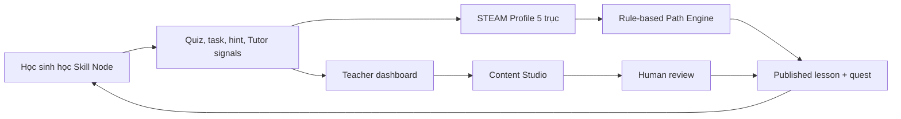

# Feature Blueprint — bám sát Proposal & Functional Role Spec

## 1. Nguồn sự thật

Tài liệu này chỉ sử dụng hai nguồn chức năng chính:

1. `EduOne_Adaptive_Learning_Proposal_v1.0.docx`
2. `EduOne_Functional_Role_Spec_v1.0.docx`

Mọi tính năng khi code phải truy vết được về ít nhất một trong các mã sau:

- `FR-x` trong Proposal.
- `M-x`, `F-xxx`, `P-xx`, `R-x`, `S-xxx` trong Functional Role Spec.
- `NFR-x` nếu là yêu cầu phi chức năng, an toàn, chi phí, audit, hiệu năng.

Nếu một ý tưởng không truy vết được về hai tài liệu này, mặc định không build trong MVP.

## 2. Luận điểm sản phẩm

EduOne không phải LMS có chatbot. EduOne là một vòng lặp thích ứng:

Hai nút thắt chính trong Proposal:

- Học sinh bỏ cuộc vì lộ trình cào bằng.
- Giảng viên quá tải vì 40-50 giờ/bài học.

Vì vậy MVP phải chứng minh được cả hai:

- cá nhân hóa lộ trình có giải thích;
- giảm thời gian sản xuất học liệu bằng Content Studio có human review.

## 3. Quy tắc chọn tính năng

| Quy tắc | Ý nghĩa khi build |
|---|---|
| P1 trước P2 | Làm Pilot/MVP trước: M1-M9 một phần, M11. Hoãn phụ huynh/social nếu chưa xong core loop |
| Một workflow hoàn chỉnh | Ưu tiên một demo end-to-end hơn nhiều màn rời rạc |
| AI có kiểm soát | Không có auto-publish; Tutor chỉ dùng nguồn đã duyệt |
| Cá nhân hóa không dùng LLM | Path Engine dùng rule + Skill Node graph + STEAM score |
| Gamification không gây áp lực | Không public leaderboard, không trừ EXP đã có |
| Dữ liệu trẻ em là mặc định nhạy cảm | Minimal data, guardian consent, parent không đọc raw chat |

## 4. Feature Map theo module

### M1 — Tài khoản & phân quyền

Nguồn: `FR0`, `F-101 -> F-107`, `P-01`, `R1-R4`.

| Feature | MVP | UI | Backend | Database | Acceptance criteria |
|---|---:|---|---|---|---|
| Student/teacher login + register | Must | Login/register/recovery/onboarding | `GET /auth/me`, `POST /auth/bootstrap` | Supabase Auth + `profiles` | JWT thật; student có grade_band, teacher ACTIVE ngay |
| RBAC server-side | Must | Route guard chỉ để UX | `requireAuth`, `requireRole` | RLS + profiles.role | Student không gọi được teacher/admin API |
| Guardian consent | Must gate / workflow next | Consent state screen | active-account middleware | `guardian_consent_at` + trusted app metadata | Dưới 16 tuổi ở `PENDING`, không vào REST/realtime học tập |
| Parent link | P2 | Invite code | parent endpoints | `parent_student_links` | Hoãn khỏi MVP demo nếu core chưa xong |

Điểm cần giữ: frontend không quyết định quyền thật; backend và RLS mới là nguồn chặn.

Quyết định sản phẩm 2026-07-18: giáo viên được tự đăng ký và active ngay, cố ý khác `F-103`. Admin vẫn không tự đăng ký. Trước pilot cần xác minh tổ chức/domain, audit và rate limit; chi tiết ở `docs/problem/teacher-student-role-impact.md`.

### M2 + M3 — Hồ sơ STEAM & đánh giá

Nguồn: `FR1`, `FR2`, `F-201 -> F-308`, `P-02`, `P-09`.

| Feature | MVP | UI | Backend | Database | Acceptance criteria |
|---|---:|---|---|---|---|
| STEAM radar | Must | Student Dashboard | dashboard endpoint | `steam_profiles` | Hiển thị 5 trục S/T/E/A/M 0-100 |
| Score explanation | Must | Insight cards | profile service | `score_events` | Có lời giải thích từng trục |
| Placement test | Should | Test screen | test scoring | `questions`, `score_events` | 20-30 câu, tối thiểu 5 câu/trục |
| Score history | Should | Profile chart | history endpoint | `score_events` | Truy vết được thay đổi điểm |
| Recalibration test | Later P1 | Test reminder | calibration service | `score_events.source_type='recalibration'` | Chỉ recalibration mới hạ điểm |

MVP demo có thể seed sẵn profile để dashboard chạy ngay, nhưng code scoring phải chuẩn bị theo `score_events`.

### M4 — Lộ trình học

Nguồn: `FR3`, `FR4`, `F-401 -> F-408`, `P-03`, `P-08`.

| Feature | MVP | UI | Backend | Database | Acceptance criteria |
|---|---:|---|---|---|---|
| Skill Node map | Must | `/student/path` | path-engine | `skill_nodes`, `skill_node_prerequisites` | Node có trạng thái done/current/locked |
| Explainable next node | Must | Recommendation card | path-engine reason builder | `steam_profiles`, `skill_nodes` | Luôn có lý do định lượng |
| Locked reason + recovery | Must | Lock tooltip/card | path-engine | `unlock_thresholds` | Ví dụ: "Cần thêm 10 điểm A" |
| Basic/Advanced variant | Should | Lesson tag | difficulty selector | `lessons.difficulty` | Chọn theo level_band/threshold |
| Explore/pre-course | Should | Explore tab | unlock scanner | pre-course Skill Nodes | Hoãn nếu dashboard/path chưa xong |

Không dùng LLM cho module này. Đây là lợi thế chi phí và explainability.

### M5 — Trải nghiệm học

Nguồn: `FR4.5`, `FR5.2`, `FR5.3`, `F-501 -> F-506`, `P-04`.

| Feature | MVP | UI | Backend | Database | Acceptance criteria |
|---|---:|---|---|---|---|
| Lesson checkpoints | Must | Lesson Player | lesson endpoint | `lessons.content` | Chỉ đọc `PUBLISHED` |
| Quiz + instant feedback | Must | QuizCard | attempts endpoint | `questions`, `attempts` | Chấm đúng/sai và phản hồi |
| Layered hints | Must | HintPanel | lesson content/question hints | JSONB content | Hint mở dần, không lộ đáp án ngay |
| Practical task | Should | Task submission | task endpoint | storage/submissions later | Hoàn thành task cộng score/EXP |
| Save progress | Should | Continue button | progress service | progress table later | Thoát giữa chừng quay lại đúng checkpoint |

MVP nên có một lesson Scratch "Vòng lặp" published, đủ checkpoint + quiz + hint + Tutor drawer.

### M6 — AI Tutor

Nguồn: `FR9`, `F-601 -> F-609`, `P-05`, `NFR-6`.

| Feature | MVP | UI | Backend | Database/AI | Acceptance criteria |
|---|---:|---|---|---|---|
| Tutor drawer | Must | Lesson Player drawer | tutor sessions | `tutor_sessions` | Hiển thị rõ đang nói với AI |
| Grounded answer | Must | Streaming answer | RAG retrieval + AI Gateway | `document_chunks`, `lessons` | Có citation checkpoint |
| Refuse out-of-scope | Must | Refusal state | similarity threshold | retrieval function | Không bịa khi không có nguồn |
| Socratic hint mode | Must | Hint-like answer | prompt constraint | prompt file | Không đưa đáp án bài đang chấm |
| Escalation to teacher | Must | "Send to teacher" | realtime event | `tutor_escalations` | Teacher thấy queue realtime |
| Safety filters | Should | Safety fallback | input/output moderation | logs + alert | Flag self-harm/harassment |

Ràng buộc kỹ thuật bắt buộc: truy hồi chunk phải chứng minh nguồn thuộc lesson `PUBLISHED`.

### M7 — Content Studio

Nguồn: `FR5`, `F-701 -> F-712`, `P-06`, `P-07`.

| Feature | MVP | UI | Backend | Database/AI | Acceptance criteria |
|---|---:|---|---|---|---|
| Source upload/sample source | Must | Studio upload | content job service | `source_documents` | Tạo job và started_at |
| Draft generation | Must | Job progress | AI Gateway | `content_jobs`, `lessons` | Draft ở status `DRAFT` |
| Review side-by-side | Must | Source pane + Draft pane | lesson edit endpoint | `lessons.content` | Teacher sửa được |
| Publish workflow | Must | Publish toolbar | publish service | `lessons.status`, `audit_log` | `reviewed_by`, `published_at`, audit log |
| Edit rate + human minutes | Should | Production report | content metrics | `content_jobs` | K-1/K-4 đo được |
| TTS | P2 | none | none | none | Không làm MVP |

Đây là phần chứng minh business value: giảm 40-50 giờ/bài học xuống mục tiêu <12 giờ.

### M8 — Gamification

Nguồn: `FR6`, `F-801 -> F-808`, `P-04`.

| Feature | MVP | UI | Backend | Database | Acceptance criteria |
|---|---:|---|---|---|---|
| XP/Level display | Must | Dashboard top bar | exp service | `exp_totals`, `exp_events` | Có total XP + level |
| Streak | Must | Streak card | streak service | `streaks` | Không phạt khi nghỉ |
| Badges | Must | Badge card | badge service | `badges`, `user_badges` | Badge demo rõ ràng |
| No public leaderboard | Must-not | Không build | Không endpoint ranking public | none | Không có bảng xếp hạng công khai |

Nếu cần visual như UI mẫu, thay "Friends / Weekly" bằng "Class Momentum" hoặc "My Milestones".

### M9 — Theo dõi & cảnh báo

Nguồn: `FR10`, `F-901 -> F-904`, `P-10`.

| Feature | MVP | UI | Backend | Database | Acceptance criteria |
|---|---:|---|---|---|---|
| Teacher heatmap | Must-lite | Teacher Dashboard | analytics service | `attempts`, skill completion | Thấy node nào nhiều học sinh tắc |
| Risk queue | Must-lite | Intervention queue | risk rules | attempts/activity | Có lý do tường minh |
| Production report | Should | Report cards | content metrics | `content_jobs` | Hiển thị human_minutes/edit_rate |
| Parent alerts | P2 | Parent portal | notification service | parent links | Hoãn |

Nhãn `AT_RISK` chỉ cho teacher/admin, tuyệt đối không hiện cho học sinh.

### M10 — Cộng đồng STEAM

Nguồn: `FR8`, `F-1001 -> F-1006`, `P-12`.

Trạng thái: P2, không build trong MVP trừ khi đã xong core.

Lý do: UGC của trẻ em cần kiểm duyệt hai tầng, SLA xử lý sự cố, blocklist tiếng Việt, phân loại ảnh/video. Rủi ro lớn hơn giá trị trong demo đầu.

### M11 — Quản trị & vận hành

Nguồn: `FR10.4`, `NFR-3`, `NFR-7`, `NFR-14`, `F-1101 -> F-1107`, `P-13`.

| Feature | MVP | UI | Backend | Database | Acceptance criteria |
|---|---:|---|---|---|---|
| AI usage dashboard | Must-lite | Admin Cost | usage endpoint | `ai_usage` | Xem chi phí theo feature |
| Daily budget/circuit breaker | Must-lite | Circuit status | AI Gateway check | `daily_cost_budgets` | Tripped thì Tutor/Studio degrade |
| Audit log | Must | Admin audit view | audit service | `audit_log` | Publish có record |
| LLM provider config | Later | Admin config | gateway config | env/config | Không cần UI sâu ở MVP |

## 5. MVP vertical slice đề xuất

### Slice 1 — Student Dashboard + Path

Mục tiêu: chứng minh cá nhân hóa giải thích được.

Nguồn: `FR1`, `FR2`, `FR3`, `FR4`, `FR6`, `F-202`, `F-207`, `F-403`, `F-406`, `F-804`, `P-03`.

Deliverables:

- Dashboard theo phong cách UI mẫu.
- Radar STEAM.
- XP/Level/Streak/Badges.
- Next Skill Node card có lý do.
- Path map với locked reasons.

API:

- `GET /api/student/dashboard`
- `GET /api/student/path`

Done when:

- Học sinh hiểu "mình nên học gì tiếp và vì sao".
- Không có leaderboard công khai.

### Slice 2 — Lesson Player + Quiz + Hint

Mục tiêu: chứng minh một Skill Node học được end-to-end.

Nguồn: `FR4.5`, `FR5.2`, `FR5.3`, `FR6.2`, `F-501 -> F-506`, `P-04`.

Deliverables:

- Published Scratch lesson.
- Checkpoints.
- Quiz.
- Hint theo tầng.
- Attempt ghi score/EXP.

API:

- `GET /api/student/lessons/:skillNodeId`
- `POST /api/student/attempts`

Done when:

- Student hoàn thành quiz/task và path/profile cập nhật.

### Slice 3 — AI Tutor + Escalation

Mục tiêu: chứng minh AI-native nhưng an toàn.

Nguồn: `FR9`, `F-601 -> F-609`, `P-05`, `NFR-6`.

Deliverables:

- Tutor drawer.
- SSE streaming.
- Citation.
- Refusal.
- Escalate to teacher.
- Teacher receives realtime event.

API:

- `POST /api/tutor/sessions`
- `POST /api/tutor/sessions/:id/messages/stream`
- `POST /api/tutor/messages/:id/escalate`
- `GET /api/teacher/escalations`

Done when:

- In-scope question gets cited answer.
- Out-of-scope question gets refusal + escalation.

### Slice 4 — Content Studio Review/Publish

Mục tiêu: chứng minh giảm thời gian sản xuất nội dung nhưng vẫn HITL.

Nguồn: `FR5`, `F-701 -> F-711`, `P-06`, `P-07`, `NFR-10`, `NFR-14`.

Deliverables:

- Teacher starts content job from sample source.
- Draft generated/mock-generated into `DRAFT`.
- Side-by-side review.
- Publish writes audit log.
- Student can only access after `PUBLISHED`.

API:

- `POST /api/teacher/content-jobs`
- `GET /api/teacher/content-jobs/:id`
- `PATCH /api/teacher/lessons/:id`
- `POST /api/teacher/lessons/:id/publish`

Done when:

- Before publish student cannot see lesson.
- After publish student can see lesson.
- Audit record exists.

### Slice 5 — Teacher/Admin Proof Panels

Mục tiêu: chứng minh vận hành và đo lường.

Nguồn: `FR10`, `NFR-3`, `NFR-7`, `NFR-14`, `P-10`, `P-13`.

Deliverables:

- Teacher heatmap lite.
- Risk queue lite.
- Admin AI usage.
- Circuit breaker status.

Done when:

- Demo trả lời được câu hỏi giám khảo: đo time saved, cost, safety, audit ra sao.

## 6. Những thứ không được build sai hướng

| Không build | Vì sao |
|---|---|
| Public leaderboard | Trái `FR6.7`, tạo áp lực điểm số |
| Parent đọc raw Tutor chat | Trái `FR7.4`, phá safe-to-fail |
| Tutor trả lời kiến thức ngoài | Trái `FR9.1`, tăng hallucination |
| Auto-publish AI content | Trái `FR5.4`, `NFR-10` |
| Path Engine dùng LLM | Trái nguyên tắc explainable/cost-tiered |
| Social community trong MVP | `FR8` là Phase 2, rủi ro UGC trẻ em cao |
| TTS/sinh ảnh AI trong MVP | Proposal đã hoãn vì chi phí/rủi ro |

## 7. Acceptance criteria cấp hệ thống

MVP đạt yêu cầu khi:

- Có ít nhất một học sinh demo nhìn thấy STEAM radar, next Skill Node, và lý do đề xuất.
- Có ít nhất một lesson `PUBLISHED` học được qua checkpoint + quiz + hint.
- Tutor có ít nhất một câu trả lời có citation và một câu refusal.
- Escalation tạo được hàng đợi cho teacher.
- Teacher publish một lesson và có audit log.
- Admin thấy cost/circuit state.
- Không có tính năng nào vi phạm các "must-not" ở mục 6.

## 8. Thứ tự code khuyến nghị

1. Scaffold frontend/backend + shared contracts.
2. Supabase Auth + profile bootstrap + server RBAC.
3. Seed QA content cho Scratch 7 Skill Nodes.
4. Student Dashboard + Path Engine data-backed.
5. Lesson Player + Attempts + EXP.
6. Tutor drawer + grounded retrieval + refusal/escalation.
7. Content Studio review/publish with AI generation.
8. Teacher heatmap + Admin cost.

Điểm tinh tế: bắt đầu bằng mock có cấu trúc giống thật, không hardcode lung tung. Mỗi mock response phải giống contract API cuối cùng để thay backend thật không vỡ UI.

## 9. Bổ sung Slice 5 — AI Tutor sinh bài luyện tương tác

Nguồn: mở rộng `FR9` -> `FR9.7` (Tutor sinh bài luyện formative grounded), features `F-610`..`F-613`, quy trình `P-05b`, vẫn thuộc `M6`, vai trò `R1` (làm) và `R2` (duyệt promotion).

| Feature | MVP | UI | Backend | Database/AI | Acceptance |
|---|---:|---|---|---|---|
| F-610 Sinh bài luyện grounded | Must | Thanh "Luyện tập" trong Tutor | `POST /tutor/exercises` | `tutor_exercises`, LLM structured output | 4 dạng, grounded chunk đã duyệt |
| F-611 Bốn dạng tương tác | Must | MCQ, matching kéo-thả, ordering, cloze | inputs controlled | payload không đáp án | Kéo-thả có fallback bàn phím (WCAG) |
| F-612 Chấm + EXP nỗ lực | Must | Kết quả + lời giải | `POST /.../submit` | `exp_events` (không score_events) | Không đụng STEAM, không mở khoá |
| F-613 Promote thành câu hỏi thật | Should | "Gửi giáo viên duyệt" | `POST /.../promote`, `/teacher/exercise-proposals` | tạo `questions` DRAFT (mcq) | HITL: giáo viên duyệt mới thành nguồn |

Ràng buộc must-not bổ sung: bài luyện Tutor **không bao giờ** ghi `score_events`/đổi STEAM/mở khoá; answer_key **không bao giờ** rời server; item chỉ vào ngân hàng câu hỏi **sau** khi giáo viên duyệt.

## 10. Bổ sung Slice 6 — Lớp học & môn học

Nguồn: phạm vi R2 “assigned classes”, `S-201`, `S-206`, kết hợp yêu cầu vận hành lớp của sản phẩm. Đây là lớp liên kết cần thiết trước Content Studio theo lớp.

| Feature | UI | Backend | Database | Acceptance |
|---|---|---|---|---|
| Danh mục môn GDPT 2018 | select theo khối/tag STEAM | `GET /teacher/subjects` | `subjects` | Môn đúng org và grade |
| Giáo viên tạo lớp | `/teacher` | `POST /teacher/classes` | `classes` | Có subject, join code, owner |
| Giáo viên mời/duyệt | class detail | invite/decision endpoints | `class_memberships` | Chỉ lớp mình sở hữu |
| Học sinh xin vào/nhận lời mời | `/student/classes` | join/respond endpoints | membership state machine | Cùng org và cùng khối |
| Đồng bộ hai vai trò | realtime status + auto refresh | Socket.IO | không write trực tiếp | roster/pending cập nhật sau transition |

Nội dung `PUBLISHED` đã khả dụng cho lộ trình chung. Phân phối nội dung riêng theo lớp cần Slice 7 với `class_content_assignments`; không dùng trạng thái membership như một cách thay thế cho publish audit.
