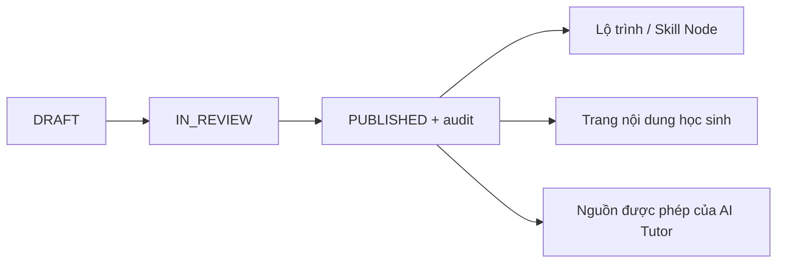
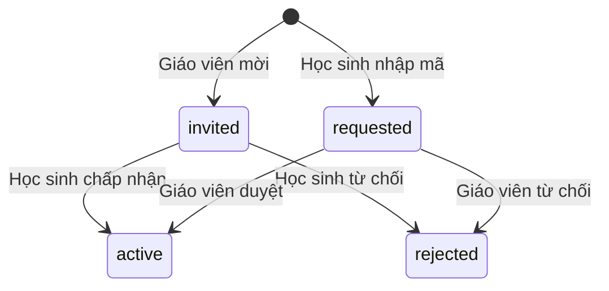

# Teacher Role & Student Impact

Tài liệu này tổng hợp trực tiếp từ hai nguồn chính:

- `EduOne_Adaptive_Learning_Proposal_v1.0.docx`
- `EduOne_Functional_Role_Spec_v1.0.docx`

Mục tiêu là giữ mọi tính năng giáo viên có tác động rõ ràng tới học sinh, dữ liệu và quy tắc xuất bản.

## 1. Quyết định sản phẩm khác đặc tả

Đặc tả `3.1` và `F-103` yêu cầu giáo viên do Admin cấp, không tự đăng ký. Theo quyết định sản phẩm ngày 2026-07-18, EduOne **cố ý thay đổi quy tắc này**:

- người dùng được chọn `Giáo viên` trên trang đăng ký;
- hồ sơ giáo viên được tạo với trạng thái `ACTIVE` ngay;
- giáo viên không cần khối lớp, ngày sinh hoặc đồng ý của người giám hộ;
- Admin vẫn là vai trò được cấp riêng, không tự đăng ký.

Giới hạn đang áp dụng để giảm phạm vi quyền: backend kiểm tra JWT và role, giáo viên chỉ thao tác lớp do mình sở hữu, học sinh phải cùng tổ chức và cùng khối lớp, mọi trạng thái thành viên được kiểm tra ở server. Trước pilot thật vẫn cần xác minh tổ chức/email trường, rate limit lời mời và audit đăng ký giáo viên.

## 2. Tính năng giáo viên từ hai tài liệu

| Nhóm | Chức năng giáo viên | Nguồn | Tác động tới học sinh |
|---|---|---|---|
| Lớp học | Tạo lớp, quản lý danh sách, xem học sinh trong lớp | Phạm vi R2/S-201; mở rộng vận hành cần cho `assigned classes` | Học sinh nhận lời mời, xin vào bằng mã và chỉ xuất hiện sau khi thành viên `active` |
| Ngân hàng câu hỏi | Tạo/sửa câu hỏi, gắn khối và trọng số STEAM | `F-301`, `F-302` | Câu hỏi đã duyệt đi vào đánh giá và phản hồi; không cho frontend giữ đáp án |
| Ngưỡng mở khóa | Thiết lập/nghiệm thu điều kiện STEAM cho pre-course | `F-407`, `FR3.1` | Lộ trình học sinh thay đổi theo ngưỡng minh bạch, không do LLM quyết định |
| Content Studio | Tải nguồn, chọn Skill Node, nhận AI draft, so sánh nguồn-draft, chỉnh sửa | `F-701` đến `F-706`, `S-202`, `S-203` | Học sinh chưa thấy nội dung ở `DRAFT`/`IN_REVIEW` |
| Review & publish | Duyệt, xuất bản, lưu phiên bản, archive, ghi audit | `F-707` đến `F-710`, `NFR-10`, `NFR-14` | Chỉ `PUBLISHED` mới được Lesson Player và Tutor sử dụng |
| AI Tutor escalation | Xem câu hỏi được chuyển lên, trả lời, duyệt Q&A vào knowledge | `F-604`, `F-605`, `P-05` | Học sinh có lối thoát khi Tutor từ chối; câu trả lời duyệt có thể cải thiện kho tri thức |
| Theo dõi lớp | Heatmap Skill Node, risk queue, đánh dấu can thiệp | `F-901` đến `F-903`, `S-201` | Giáo viên biết học sinh nào đang tắc; nhãn rủi ro không hiển thị cho học sinh |
| Hồ sơ học sinh | Xem tiến độ/hồ sơ ở chế độ read-only trong lớp phụ trách | R2, `S-206` | Học sinh được hỗ trợ theo dữ liệu thật; giáo viên không sửa trực tiếp điểm STEAM |

Giáo viên không được xem học sinh ngoài lớp phụ trách, sửa trực tiếp STEAM score, tự động xuất bản AI draft, hoặc xuất bản mà không có người duyệt và audit.

## 3. Xuất bản ảnh hưởng tới học sinh như thế nào

Đúng: khi giáo viên xuất bản nội dung, học sinh phải có nơi để học nội dung đó. Luồng chuẩn là:

`PUBLISHED` là điều kiện cần, không mặc nhiên là phân phối cho toàn bộ học sinh. Có hai phạm vi:

1. Nội dung theo lộ trình chung: học sinh thấy khi lesson thuộc Skill Node phù hợp với khối, prerequisite và ngưỡng STEAM.
2. Nội dung theo lớp: cần thêm quan hệ `class_content_assignments` (hoặc `class_skill_nodes`) để giáo viên gán lesson/Skill Node cho một lớp; chỉ thành viên `active` của lớp được xem.

Hiện tại lộ trình chung đã lọc `PUBLISHED`. Slice lớp học hiện tại mới hoàn thành lớp, môn và thành viên; màn hình/giao dịch gán nội dung cho lớp là bước tiếp theo của Content Studio.

## 4. Luồng lớp học đã triển khai

Nếu học sinh đã `requested` rồi giáo viên gửi lời mời, hoặc đã `invited` rồi học sinh nhập mã, hai ý chí trùng nhau nên trạng thái hội tụ ngay thành `active`.

## 5. Mô hình môn học STEAM

Danh mục `subjects` bám bảng phân loại GDPT 2018 người dùng cung cấp:

- `S`: Tự nhiên & Xã hội/Khoa học, Khoa học tự nhiên, Vật lý, Hóa học, Sinh học;
- `T`: Tin học;
- `E`: Công nghệ;
- `A`: Tiếng Việt, Ngữ văn, Mỹ thuật, Âm nhạc, Đạo đức, Lịch sử & Địa lý;
- `M`: Toán.

Mỗi môn gắn một `grade_band`: `primary`, `secondary`, hoặc `high_school`. Backend không cho mời/xin vào khi khối học sinh khác khối lớp.

## 6. Trạng thái triển khai

Đã có: teacher self-registration, danh mục môn, tạo lớp, mã lớp, mời học sinh, học sinh xin vào, duyệt/từ chối, nhận/từ chối lời mời, roster và cập nhật Socket.IO. Cả hai luồng thật đã được xác minh trên Supabase: `invited -> active` và `requested -> active`.

Tiếp theo theo tài liệu: gán nội dung/Skill Node cho lớp, Content Studio review-publish, trang nội dung lớp phía học sinh, heatmap/risk queue và hồ sơ học sinh read-only.
